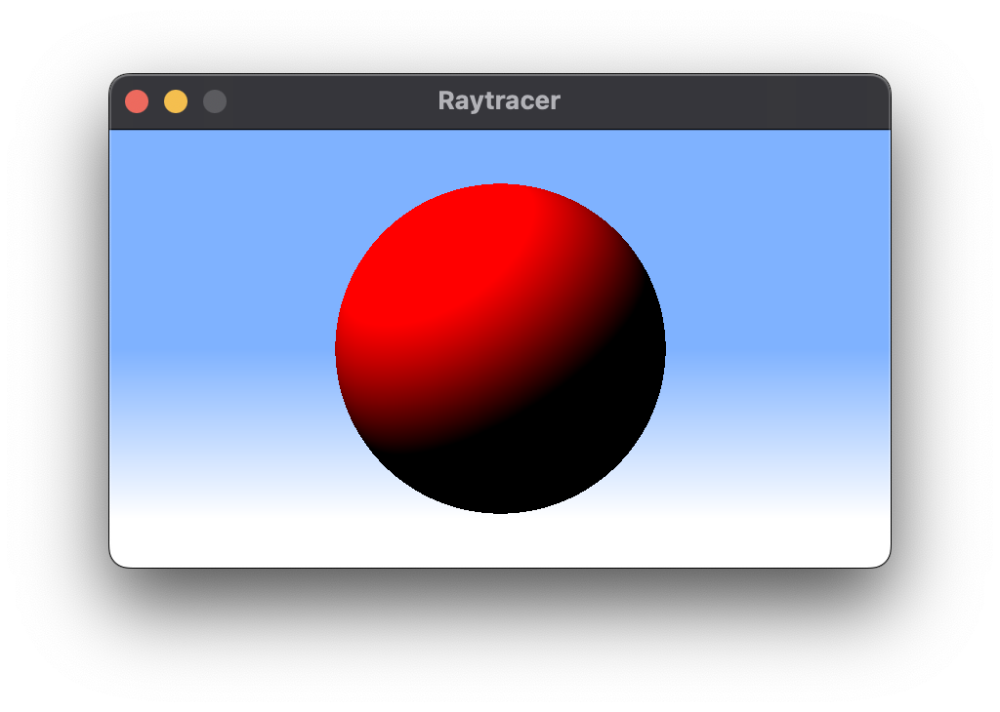
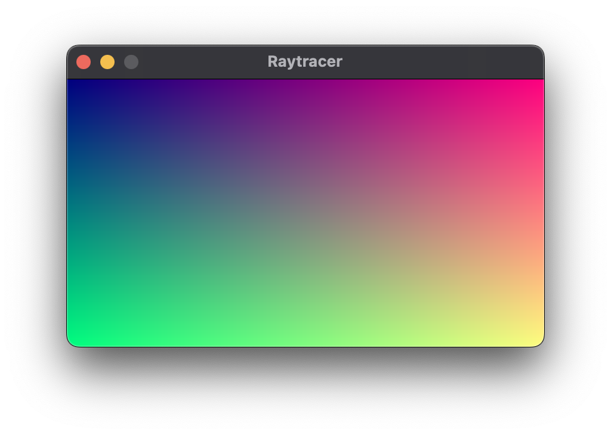
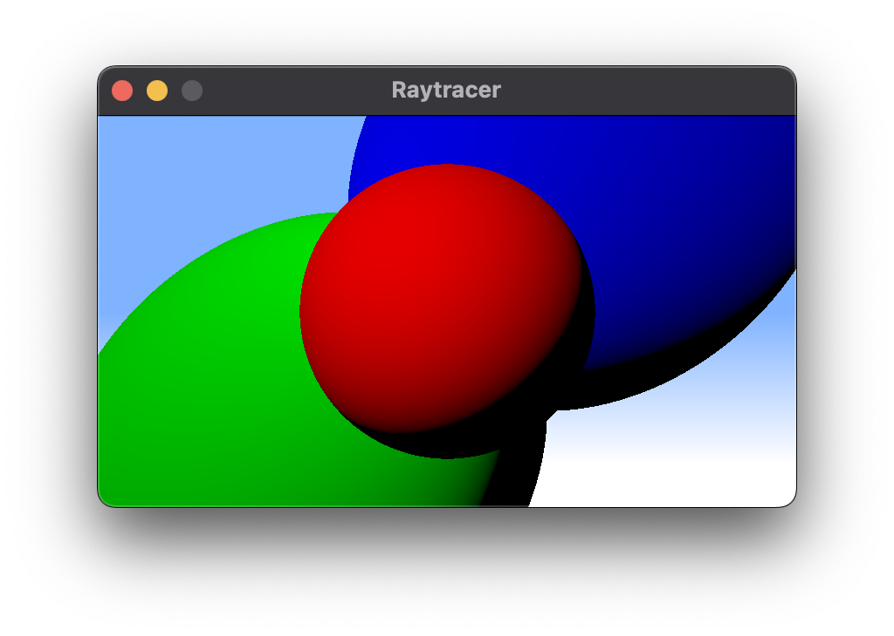

# C++ Raytracer
Ray tracing experiments with C++

    

## Project
This is a simple implementation of a ray tracing engine in C++. This project is still a work in progress, expect bugs.

My intention is to register my learnings throughout this project in this repository.

## Thanks to
| Name | Description |
| -- | -- |
| [atdean's SDL2 project templat](https://github.com/atdean/sdl2-cpp-project-template) | Provides a really nice starting template for including SDL2 on CMake |
| [SDL2](https://www.libsdl.org/) | For handling graphics cross platform |

## Dev log
### Day 0
I had my experiments with Ray tracing before but never really got serious. I was able to achieve something similar with AssemblyScript compiling to WASM, but the performance wasn't really what I was expecting, which led me to try with native C++ and SDL.

I started learning the basics of SDL, it has been a while since my last SDL project.

    
    <small>Here's me rendering a gradient</small>

---
### Day 1
After a few side projects in SDL, it's time to start ray tracing!

    
    <small>Some HighDPI/Retina enabled rendering</small>

  

    
      
    <small>And some really cool realtime 120fps interaction</small>

  

This was basically the first day. Where I got some basic ray casting working.

It seems that doing the operations in the back buffer penalizes performance when setting pixels manually, maybe having a surface and manipulating it manually would provide a better performance, since now the actual ray tracing takes 6ms tops and the back buffer manipulation takes 40ms 😕.

### Day 1.5
Basically a couple of refactoring in the SDL side, experimented with SDL_Surface, writing directly on the window surface, which gained some performance but was lacking some functionality, like HighDPI screen support.
Fixed that by using a Texture, manipulating the texture pixels and rendering to a Renderer, which preserves the software layer to interact with OpenGL/Metal/Vulkan and whatnot.
This proved to be worth the while, frames take as much as 1ms to render, with 3 spheres!

    

